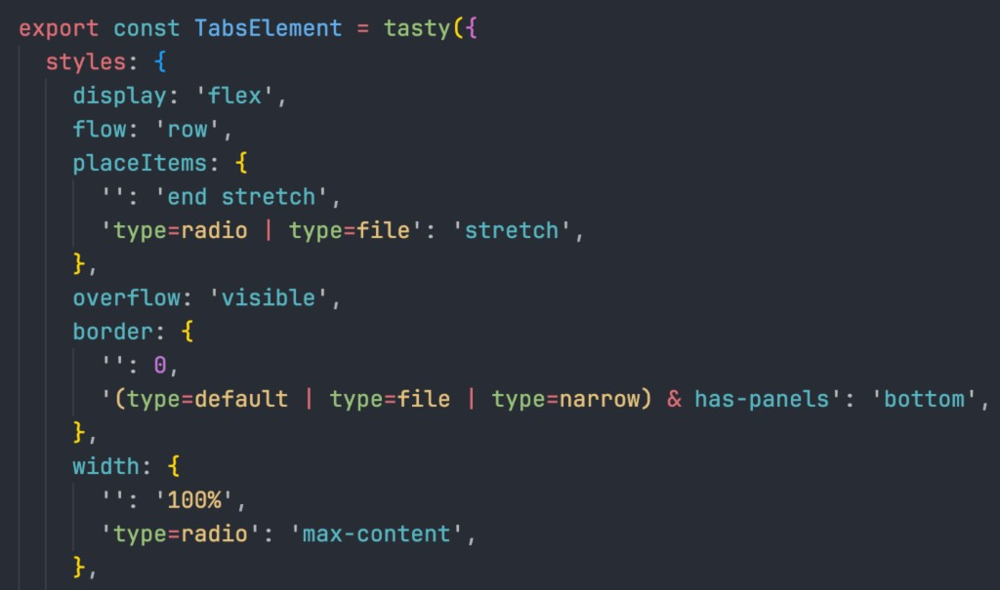

<p align="center">
  
</p>

<h1 align="center">Tasty</h1>

<p align="center">
  <strong>Deterministic styling for stateful component systems.</strong><br>
  A design-system styling engine that compiles component states into mutually exclusive selectors.
</p>

<p align="center">
  <a href="https://www.npmjs.com/package/@tenphi/tasty"></a>
  <a href="https://github.com/tenphi/tasty/actions/workflows/ci.yml"></a>
  <a href="https://github.com/tenphi/tasty/blob/main/LICENSE"></a>
</p>

---

Tasty is a styling engine for design systems that generates deterministic CSS for stateful components.

It compiles state maps into **mutually exclusive selectors**, so for a given property and component state, one branch wins by construction instead of competing through cascade and specificity.

That is the core guarantee: component styling resolves from declared state logic, not from source-order accidents or specificity fights.

Tasty fits best when you are building a design system or component library with intersecting states, variants, tokens, sub-elements, responsive rules, and extension semantics that need to stay predictable over time.

On top of that foundation, Tasty gives teams a governed styling model: a CSS-like DSL, tokens, recipes, typed style props, sub-elements, and multiple rendering modes.

- **New here?** Start with [Comparison](docs/comparison.md) if you are evaluating fit.
- **Adopting Tasty?** Read the [Adoption Guide](docs/adoption.md).
- **Want the mechanism first?** Jump to [How It Actually Works](#how-it-actually-works).
- **Ready to build?** Go to [Getting Started](docs/getting-started.md).

## Why Tasty

- **Deterministic composition, not cascade fights** — Stateful styles resolve from the state map you declared, not from selector competition. See [How It Actually Works](#how-it-actually-works).
- **Built for design-system teams** — Best fit for reusable component systems with complex state interactions.
- **A governed styling model, not just syntax sugar** — Design-system authors define the styling language product teams consume.
- **DSL that still feels like CSS** — Familiar property names, less selector boilerplate. Start with the [Style DSL](docs/dsl.md), then use [Style Properties](docs/styles.md) as the handler reference.

### Supporting capabilities

- **Typed style props and mod props** — `styleProps` exposes selected CSS properties as typed React props (`<Space flow="row" gap="2x">`); `modProps` does the same for modifier keys (`<Button isLoading size="large">`). Both support state maps and full TypeScript autocomplete. See [Style Props](#style-props) and [Mod Props](#mod-props).
- **Runtime, SSR, and zero-runtime options** — Use `tasty()` for runtime React components, add SSR integrations when your framework renders that runtime on the server, or use `tastyStatic()` when you specifically want build-time extraction instead of runtime styling.
- **Broad modern CSS coverage** — Media queries, container queries, `@supports`, `:has()`, `@starting-style`, `@property`, `@keyframes`, and more. Features that do not fit the component model (such as `@layer` and `!important`) are intentionally left out.
- **Performance and caching** — Runtime mode injects CSS on demand, reuses chunks aggressively, and relies on multi-level caching so large component systems stay practical.
- **TypeScript-first and AI-friendly** — Style definitions are declarative, structurally consistent, and fully typed, which helps both humans and tooling understand advanced stateful styles without hidden cascade logic.

## Why It Exists

Modern component styling becomes fragile when multiple selectors can still win for the same property. Hover, disabled, theme, breakpoint, parent state, and root state rules start competing through specificity and source order.

Tasty replaces that competition with explicit state-map resolution. Each property compiles into mutually exclusive branches, so component styling stays deterministic as systems grow. For the full mechanism, jump to [How It Actually Works](#how-it-actually-works).

## Installation

```bash
pnpm add @tenphi/tasty
```

Requirements:

- Node.js 20+
- React 18+ (peer dependency for the React entry points)
- `pnpm`, `npm`, or `yarn`

Other package managers:

```bash
npm add @tenphi/tasty
yarn add @tenphi/tasty
```

## Start Here

For the fuller docs map beyond the quick routes above, start here:

- **[Comparison](docs/comparison.md)** — read this first if you are evaluating whether Tasty fits your team's styling model
- **[Adoption Guide](docs/adoption.md)** — understand who Tasty is for, where it fits, and how to introduce it incrementally
- **[Getting Started](docs/getting-started.md)** — the canonical onboarding path: install, first component, optional shared `configure()`, ESLint, editor tooling, and rendering mode selection
- **[Style rendering pipeline](docs/PIPELINE.md)** — see the selector model behind deterministic style resolution
- **[Docs Hub](docs/README.md)** — choose docs by role and task: runtime, zero-runtime, runtime SSR integration, design-system authoring, internals, and debugging
- **[Methodology](docs/methodology.md)** — the recommended component model and public API conventions for design-system code

## Quick Start

### Create a styled component

```tsx
import { tasty } from '@tenphi/tasty';

const Card = tasty({
  as: 'div',
  styles: {
    display: 'flex',
    flow: 'column',
    padding: '24px',
    gap: '12px',
    fill: 'white',
    color: '#222',
    border: '1px solid #ddd',
    radius: '12px',
  },
});

// Just a React component
<Card>Hello World</Card>
```

Every value maps to CSS you'd recognize. This example is intentionally a simple first contact, not a tour of the whole DSL.

When you want a more design-system-shaped authoring model, Tasty also supports built-in units, tokens, recipes, state aliases, and color values such as `okhsl(...)` without extra runtime libraries.

Use `configure()` when you want to define shared tokens, state aliases, recipes, or other conventions for your app or design system. For a fuller onboarding path, follow [Getting Started](docs/getting-started.md).

### Add state-driven styles

```tsx
const Button = tasty({
  as: 'button',
  styles: {
    padding: '1.5x 3x',
    fill: {
      '': '#primary',
      ':hover': '#primary-hover',
      ':active': '#primary-pressed',
      '[disabled]': '#surface',
    },
    color: {
      '': '#on-primary',
      '[disabled]': '#text.40',
    },
    cursor: {
      '': 'pointer',
      '[disabled]': 'not-allowed',
    },
    transition: 'theme',
  },
});
```

State keys support pseudo-classes first (`:hover`, `:active`), then modifiers (`theme=danger`), attributes (`[disabled]`), media/container queries, root states, and more. Tasty compiles them into exclusive selectors automatically.

### Extend any component

```tsx
import { Button } from 'my-ui-lib';

const DangerButton = tasty(Button, {
  styles: {
    fill: {
      '': '#danger',
      ':hover': '#danger-hover',
    },
  },
});
```

Child styles merge with parent styles intelligently — state maps can extend or replace parent states per-property.

### Optional: configure shared conventions

```tsx
import { configure } from '@tenphi/tasty';

configure({
  states: {
    '@mobile': '@media(w < 768px)',
    '@tablet': '@media(w < 1024px)',
    '@dark': '@root(schema=dark) | (!@root(schema) & @media(prefers-color-scheme: dark))',
  },
  recipes: {
    card: { padding: '4x', fill: '#surface', radius: '1r', border: true },
  },
});
```

Use `configure()` once when your app or design system needs shared aliases, tokens, recipes, or parser extensions. Predefined states turn complex selector logic into single tokens, so teams can write `@mobile` instead of repeating media query expressions in every component.

### Props as the public API

`styleProps` exposes selected CSS properties as typed React props, and `modProps` does the same for modifier keys. Together they let design systems define a governed, typed component API without wrapper elements or `styles` overrides:

```tsx
<Space flow="row" gap="2x" placeItems="center">
  <Button isLoading size="large" placeSelf="end">Submit</Button>
</Space>
```

See [Style Props](#style-props) and [Mod Props](#mod-props) below, or the full reference in [Runtime API](docs/runtime.md#style-props).

## Choose a Styling Approach

Once you understand the component model, pick the rendering mode that matches your app.

| Approach | Entry point | Best for | Trade-off |
|----------|-------------|----------|-----------|
| **Runtime** | `@tenphi/tasty` | Interactive apps with reusable stateful components and design systems | Full feature set; CSS is generated on demand at runtime |
| **Zero-runtime** | `@tenphi/tasty/static` | Static sites, SSG, landing pages | Requires the Babel plugin; no component-level `styleProps` or runtime-only APIs |

If your framework can execute runtime React code on the server, you can also add **SSR on top of runtime** with `@tenphi/tasty/ssr/*`. This uses the same `tasty()` pipeline, but collects CSS during server rendering and hydrates the cache on the client. That is the model for Next.js, generic React SSR, and Astro islands. See [Getting Started](docs/getting-started.md#choosing-a-rendering-mode), [Zero Runtime](docs/tasty-static.md), and [Server-Side Rendering](docs/ssr.md).

## How It Actually Works

This is the core idea that makes everything else possible.

For the end-to-end architecture — parsing state keys, building exclusive conditions, merging by output, and materializing selectors and at-rules — see **[Style rendering pipeline](docs/PIPELINE.md)**.

### The structural problem with normal CSS

First, the **cascade** resolves conflicts by specificity and source order: when multiple selectors match, the one with the highest specificity wins, or — if specificity is equal — the last one in source order wins. That makes styles inherently fragile. Reordering imports, adding a media query, or composing components from different libraries can silently break styling.

A small example makes this tangible. Two rules for a button's background:

```css
.btn:hover     { background: dodgerblue; }
.btn[disabled] { background: gray; }
```

Both selectors have specificity `(0, 1, 1)`. When the button is hovered **and** disabled, both match — and the last rule in source order wins. Swap the two lines and a hovered disabled button silently turns blue instead of gray. This class of bug is invisible in code review because the logic is correct; only the ordering is wrong.

### Why real state logic is hard to author by hand

Authoring selectors that capture real-world state logic is fundamentally hard. A single state like "dark mode" may depend on a root attribute, an OS preference, or both — each branch needing its own selector, proper negation of competing branches, and correct `@media` nesting. The example below shows the CSS you'd write by hand for just *one* property with *one* state. Scale that across dozens of properties, then add breakpoints and container queries, and the selector logic quickly becomes unmanageable.

### What Tasty generates instead

Tasty solves both problems at once: **every state mapping compiles into mutually exclusive selectors.**

```tsx
const Text = tasty({
  styles: {
    color: {
      '': '#text',
      '@dark': '#text-on-dark',
    },
    padding: {
      '': '4x',
      '@mobile': '2x',
    },
  },
});
```

If `@dark` expands to `@root(schema=dark) | (!@root(schema) & @media(prefers-color-scheme: dark))`, try writing the CSS by hand. A first attempt might look like this:

```css
/* First attempt — the @media branch is too broad */
.t0 { color: var(--text-color); }
:root[data-schema="dark"] .t0 { color: var(--text-on-dark-color); }
@media (prefers-color-scheme: dark) {
  .t0 { color: var(--text-on-dark-color); }
}
```

The `@media` branch fires even when `data-schema="light"` is explicitly set. Fix that:

```css
/* Second attempt — @media is scoped, but the default is still too broad */
.t0 { color: var(--text-color); }
:root[data-schema="dark"] .t0 { color: var(--text-on-dark-color); }
@media (prefers-color-scheme: dark) {
  :root:not([data-schema]) .t0 { color: var(--text-on-dark-color); }
}
```

Better — but the bare `.t0` default still matches unconditionally. It matches in dark mode, it matches when `data-schema="dark"` is set, and it can beat the attribute selector by source order if another rule re-declares it later. There is no selector that says "apply this default only when none of the dark branches win."

This is just *one* property with *one* state, and getting it right already takes multiple iterations. The correct selectors require negating every other branch — which is exactly what Tasty generates automatically:

```css
/* Branch 1: Explicit dark schema */
:root[data-schema="dark"] .t0.t0 {
  color: var(--text-on-dark-color);
}

/* Branch 2: No schema attribute + OS prefers dark */
@media (prefers-color-scheme: dark) {
  :root:not([data-schema]) .t0.t0 {
    color: var(--text-on-dark-color);
  }
}

/* Default: no schema + OS does not prefer dark */
@media (not (prefers-color-scheme: dark)) {
  :root:not([data-schema="dark"]) .t0.t0 {
    color: var(--text-color);
  }
}

/* Default: schema is set but not dark (any OS preference) */
:root:not([data-schema="dark"])[data-schema] .t0.t0 {
  color: var(--text-color);
}
```

### What guarantee that gives you

Every rule is guarded by the negation of higher-priority rules. No two rules can match at the same time. No specificity arithmetic. No source-order dependence. Components compose and extend without collisions.

By absorbing selector complexity, Tasty makes advanced CSS patterns practical again — nested container queries, multi-condition `@supports` gates, and combined root-state/media branches. You stay in pure CSS instead of relying on JavaScript workarounds, so the browser can optimize layout, painting, and transitions natively. Tasty keeps the solution in CSS while removing much of the selector bookkeeping that is hard to maintain by hand.

[Try it in the Cube UI Kit Storybook playground →](https://cube-ui-kit.vercel.app/?path=/story/getting-started-tasty-playground--playground)

## Capabilities

This section is a quick product tour. For the canonical guides and references, start from the [Docs Hub](docs/README.md).

### Design Tokens and Custom Units

Tokens are first-class. Colors use `#name` syntax. Spacing, radius, and border width use multiplier units tied to CSS custom properties:

```tsx
fill: '#surface',         // → var(--surface-color)
color: '#text.80',        // → 80% opacity text token
padding: '2x',            // → calc(var(--gap) * 2)
radius: '1r',             // → var(--radius)
border: '1bw solid #border',
```

| Unit | Maps to | Example |
|------|---------|---------|
| `x` | `--gap` multiplier | `2x` → `calc(var(--gap) * 2)` |
| `r` | `--radius` multiplier | `1r` → `var(--radius)` |
| `bw` | `--border-width` multiplier | `1bw` → `var(--border-width)` |
| `ow` | `--outline-width` multiplier | `1ow` → `var(--outline-width)` |
| `cr` | `--card-radius` multiplier | `1cr` → `var(--card-radius)` |

Define your own units via `configure({ units: { ... } })`.

### State System

Every style property accepts a state mapping object. Keys can be combined with boolean logic:

| State type | Syntax | CSS output |
|------------|--------|------------|
| Data attribute (boolean modifier) | `disabled` | `[data-disabled]` |
| Data attribute (value modifier) | `theme=danger` | `[data-theme="danger"]` |
| Pseudo-class | `:hover` | `:hover` |
| Attribute selector | `[role="tab"]` | `[role="tab"]` |
| Class selector (supported) | `.is-active` | `.is-active` |
| Media query | `@media(w < 768px)` | `@media (width < 768px)` |
| Container query | `@(panel, w >= 300px)` | `@container panel (width >= 300px)` |
| Root state | `@root(schema=dark)` | `:root[data-schema="dark"]` |
| Parent state | `@parent(theme=danger)` | `:is([data-theme="danger"] *)` |
| Feature query | `@supports(display: grid)` | `@supports (display: grid)` |
| Entry animation | `@starting` | `@starting-style` |

Combine with `&` (AND), `|` (OR), `!` (NOT):

```tsx
fill: {
  '': '#surface',
  'theme=danger & :hover': '#danger-hover',
  '[aria-selected="true"]': '#accent-subtle',
}
```

### Sub-Element Styling

Compound components can style inner parts from the parent definition with capitalized keys in `styles` and optional `elements` declarations, producing typed sub-components like `<Card.Title />` instead of separate wrapper components or ad hoc class naming.

Sub-elements share the root state context by default, so keys like `:hover`, modifiers, root states, and media queries resolve as one coordinated styling block. Use `@own(...)` when a sub-element should react to its own state, and use the `$` selector affix when you need precise descendant targeting.

See [Runtime API - Sub-element Styling](docs/runtime.md#sub-element-styling), [Style DSL - Advanced States](docs/dsl.md#advanced-states--prefix), and [Methodology](docs/methodology.md#component-architecture-root--sub-elements).

### Style Props

`styleProps` exposes selected CSS properties as typed React props. Components control which properties to open up; consumers get layout and composition knobs without `styles` overrides. Supports state maps for responsive values.

```tsx
const Space = tasty({
  styles: { display: 'flex', flow: 'column', gap: '1x' },
  styleProps: FLOW_STYLES,
});

<Space flow="row" gap={{ '': '2x', '@tablet': '4x' }}>
```

See [Runtime API - Style Props](docs/runtime.md#style-props) and [Methodology - styleProps](docs/methodology.md#styleprops-as-the-public-api).

### Mod Props

`modProps` exposes modifier keys as typed React props — the modifier equivalent of `styleProps`. Accepts an array of key names or an object with type descriptors (`Boolean`, `String`, `Number`, or enum arrays) for full TypeScript autocomplete.

```tsx
const Button = tasty({
  as: 'button',
  modProps: { isLoading: Boolean, size: ['sm', 'md', 'lg'] as const },
  styles: {
    fill: { '': '#primary', isLoading: '#primary.5' },
    padding: { '': '2x 4x', 'size=sm': '1x 2x' },
  },
});

<Button isLoading size="lg">Submit</Button>
```

See [Runtime API - Mod Props](docs/runtime.md#mod-props) and [Methodology - modProps](docs/methodology.md#modprops-and-mods).

### Variants

Variants let one component expose named visual versions without pre-generating a separate class for every possible combination. In runtime mode, Tasty emits only the variant CSS that is actually used.

See [Runtime API - Variants](docs/runtime.md#variants).

### Recipes

Recipes are reusable style bundles defined in `configure({ recipes })` and applied with the `recipe` style property. They are useful when your design system wants shared state logic or visual presets without forcing every component to repeat the same style map.

Use `/` to post-apply recipes after local styles when recipe states should win the final merge order, and use `none` to skip base recipes entirely.

See [Style DSL - Recipes](docs/dsl.md#recipes) and [Configuration - recipes](docs/configuration.md#recipes).

### Auto-Inferred `@property`

Tasty usually removes the need to hand-author CSS [`@property`](https://developer.mozilla.org/en-US/docs/Web/CSS/@property) rules. When a custom property receives a concrete value, Tasty infers its syntax and registers the matching `@property` automatically, which makes transitions and animations on custom properties work without extra boilerplate.

If you prefer explicit control, disable inference with `configure({ autoPropertyTypes: false })` or declare the properties yourself.

See [Style DSL - Properties (`@property`)](docs/dsl.md#properties-property).

### Explicit `@properties`

Use explicit `@properties` only when you need to override defaults such as `inherits: false` or a custom `initialValue`.

See [Style DSL - Properties (`@property`)](docs/dsl.md#properties-property).

### React Hooks

When you do not need a full component wrapper, use the hooks directly: `useStyles` for local class names, `useGlobalStyles` for selector-scoped global CSS, `useRawCSS` for raw rules, plus `useKeyframes` and `useProperty` for animation and custom-property primitives.

See [Runtime API - Hooks](docs/runtime.md#hooks).

### Zero-Runtime Mode

Use `tastyStatic` when you want the same DSL and state model, but with CSS extracted at build time and no styling runtime in the client bundle. It is a strong fit for static sites, landing pages, and other build-time-first setups.

See [Zero Runtime (tastyStatic)](docs/tasty-static.md) and [Getting Started - Choosing a rendering mode](docs/getting-started.md#choosing-a-rendering-mode).

### `tasty` vs `tastyStatic`

`tasty()` returns React components and injects CSS on demand at runtime. `tastyStatic()` returns class names and extracts CSS during the build. Both share the same DSL, tokens, units, state mappings, and recipes, so the main choice is runtime flexibility versus build-time extraction.

See [Zero Runtime (tastyStatic)](docs/tasty-static.md), [Runtime API](docs/runtime.md), and [Comparison - Build-time vs runtime](docs/comparison.md#build-time-vs-runtime).

### Server-Side Rendering

SSR layers on top of runtime `tasty()` rather than introducing a separate styling model. Existing components stay unchanged while Tasty collects CSS during server rendering and hydrates the cache on the client.

Use `@tenphi/tasty/ssr/next` for Next.js App Router, `@tenphi/tasty/ssr/astro` for Astro, or the core SSR API for other React SSR setups.

See the [full SSR guide](docs/ssr.md).

## Entry Points

| Import | Description | Platform |
|--------|-------------|----------|
| `@tenphi/tasty` | Runtime style engine (`tasty`, hooks, `configure`) | Browser |
| `@tenphi/tasty/static` | Zero-runtime static styles (`tastyStatic`) | Browser |
| `@tenphi/tasty/core` | Lower-level internals (config, parser, pipeline, injector, style handlers) for tooling and advanced use | Browser / Node |
| `@tenphi/tasty/babel-plugin` | Babel plugin for zero-runtime CSS extraction | Node |
| `@tenphi/tasty/zero` | Programmatic extraction API | Node |
| `@tenphi/tasty/next` | Next.js integration wrapper | Node |
| `@tenphi/tasty/ssr` | Core SSR API (collector, context, hydration) | Node |
| `@tenphi/tasty/ssr/next` | Next.js App Router SSR integration | Node |
| `@tenphi/tasty/ssr/astro` | Astro middleware + auto-hydration | Node / Browser |

## Browser Requirements

Tasty's exclusive selector system relies on modern CSS pseudo-class syntax:

- **`:is()`** — available across all major browsers since January 2021 ([MDN Baseline](https://developer.mozilla.org/en-US/docs/Web/CSS/:is)).
- **Level-4 `:not()` with selector lists** — Chrome/Edge 88+, Firefox 84+, Safari 9+, Opera 75+.
- **Not supported:** IE 11.

## Performance

### Bundle Size

All sizes measured with [size-limit](https://github.com/ai/size-limit) — minified and brotli-compressed, including all dependencies.

| Entry point | Size |
|-------------|------|
| `@tenphi/tasty` (runtime + SSR) | ~44 kB |
| `@tenphi/tasty/core` (runtime, no SSR) | ~41 kB |
| `@tenphi/tasty/static` (zero-runtime) | ~1.5 kB |

Run `pnpm size` for exact up-to-date numbers.

### Runtime Benchmarks

If you choose the runtime approach, performance is usually a non-issue in practice. The numbers below show single-call throughput for the core pipeline stages, measured with `vitest bench` on an Apple M1 Max (Node 22).

| Operation | ops/sec | Latency (mean) |
|-----------|--------:|---------------:|
| `renderStyles` — 5 flat properties (cold) | ~72,000 | ~14 us |
| `renderStyles` — state map with media/hover/modifier (cold) | ~22,000 | ~46 us |
| `renderStyles` — same styles (cached) | ~7,200,000 | ~0.14 us |
| `parseStateKey` — simple key like `:hover` (cold) | ~1,200,000 | ~0.9 us |
| `parseStateKey` — complex OR/AND/NOT key (cold) | ~190,000 | ~5 us |
| `parseStateKey` — any key (cached) | ~3,300,000–8,900,000 | ~0.1–0.3 us |
| `parseStyle` — value tokens like `2x 4x` (cold) | ~345,000 | ~3 us |
| `parseStyle` — color tokens (cold) | ~525,000 | ~1.9 us |
| `parseStyle` — any value (cached) | ~15,500,000 | ~0.06 us |

"Cold" benchmarks use unique inputs to bypass all caches. Cached benchmarks reuse a single input and measure the LRU hot path.

Run `pnpm bench` to reproduce.

#### What This Means in Practice

- **Cached path dominates production.** After a component's first render, subsequent renders with stable styles skip the pipeline entirely (React `useMemo` + LRU cache hits at every level). All cached operations are sub-microsecond — effectively free.
- **Cold path is fast enough.** The heaviest cold operation — a complex state map with media queries, hover, and modifiers — takes ~46 us. Even a page with 100 unique styled components adds only ~5 ms of total style computation on first render, negligible next to React reconciliation and DOM work.
- **Cache multipliers are 30x–100x.** This confirms the multi-level LRU architecture (parser, state-key, simplify, condition, pipeline) is delivering real value.
- **Comparable to lighter systems.** Emotion's `css()` is typically 5–20 us for simple styles; Tasty's cold `renderStyles` at ~14 us for 5 properties is in the same range despite doing significantly more work (state maps, design tokens, sub-elements, chunking).
- **On slower devices.** The benchmarks above are from an M1 Max (Geekbench 6 SC ~2,400). A mid-range consumer laptop (~1,800 SC) is roughly 1.3x slower; a mid-range phone (~1,200 SC) is roughly 2x slower; a budget phone (~700 SC) is roughly 3–4x slower. Even at 4x, the heaviest cold operation stays under 200 us and 100 unique components under 20 ms — still well within a single frame budget. The cached path remains sub-microsecond on all devices.

### How It Stays Fast

- CSS is generated and injected only when styles are actually used.
- Multi-level caching avoids repeated parsing and style recomputation.
- Styles are split into reusable chunks and applied as multiple class names, so matching chunks can be reused across components instead of re-injected.
- Style normalization guarantees equivalent style input resolves to the same chunks, improving deduplication hit rates.
- A style garbage collector removes unused styles/chunks over time.
- A dedicated style injector minimizes DOM/style-tag overhead.
- This approach is validated in enterprise-scale apps where runtime styling overhead is not noticeable in normal UI flows.

## Ecosystem

Tasty is the core of a production-ready styling platform. These companion tools complete the picture:

### [ESLint Plugin](https://github.com/tenphi/eslint-plugin-tasty)

`@tenphi/eslint-plugin-tasty` — 27 total lint rules for style property names, value syntax, token existence, state keys, and best practices. The `recommended` preset enables 18 of them as a practical default. Catch typos and invalid styles at lint time, not at runtime.

```bash
pnpm add -D @tenphi/eslint-plugin-tasty
```

```js
import tasty from '@tenphi/eslint-plugin-tasty';
export default [tasty.configs.recommended];
```

### [Glaze](https://github.com/tenphi/glaze)

`@tenphi/glaze` — OKHSL-based color theme generator with automatic WCAG contrast solving. Generate light, dark, and high-contrast palettes from a single hue, and export them directly as Tasty color tokens.

```tsx
import { glaze } from '@tenphi/glaze';

const theme = glaze(280, 80);
theme.colors({
  surface: { lightness: 97 },
  text: { base: 'surface', lightness: '-52', contrast: 'AAA' },
});

const tokens = theme.tasty(); // Ready-to-use Tasty tokens
```

### [VS Code Extension](https://github.com/tenphi/tasty-vscode-extension)

Syntax highlighting for Tasty styles in TypeScript, TSX, JavaScript, and JSX. Highlights color tokens, custom units, state keys, presets, and style properties inside `tasty()`, `tastyStatic()`, and related APIs.

<p align="center">
  
</p>

## Built with Tasty

### [tasty.style](https://tasty.style) ([source](https://github.com/tenphi/tasty.style))

The official Tasty documentation and landing page — itself built entirely with Tasty. A showcase for zero-runtime styling via `tastyStatic`, SSR with Next.js, and OKHSL color theming with Glaze.

### [Cube Cloud](https://cube.dev/)

Enterprise universal semantic layer platform by Cube Dev, Inc. Cube Cloud unifies data modeling, caching, access control, and APIs (REST, GraphQL, SQL, AI) for analytics at scale. Tasty has powered its frontend for over 5 years in production.

### [Cube Cloud for Excel and Google Sheets](https://cube.dev/)

A single spreadsheet add-in deployed to both [Microsoft Excel](https://marketplace.microsoft.com/en-us/product/office/WA200008486) and [Google Sheets](https://workspace.google.com/u/0/marketplace/app/cube_cloud_for_sheets/641460343379). Connects spreadsheets to any cloud data platform (BigQuery, Databricks, Snowflake, Redshift, and more) via Cube Cloud's universal semantic layer.

### [Cube UI Kit](https://github.com/cube-js/cube-ui-kit) ([storybook](https://cube-ui-kit.vercel.app/))

Open-source React UI kit built on Tasty + React Aria. 100+ production components proving Tasty works at design-system scale. A reference implementation and a ready-to-use component library.

## Documentation

Start from the docs hub if you want the shortest path to the right guide for your role or styling approach.

- **[Docs Hub](docs/README.md)** — audience-based navigation across onboarding, design-system authoring, runtime, zero-runtime, runtime SSR integration, debugging, and internals

### Start here

- **[Getting Started](docs/getting-started.md)** — Installation, first component, optional shared configuration, ESLint plugin setup, editor tooling, and rendering mode decision tree
- **[Methodology](docs/methodology.md)** — The recommended patterns for structuring Tasty components: root + sub-elements, styleProps, tokens, styles vs style, wrapping and extension

### Guides

- **[Building a Design System](docs/design-system.md)** — Practical guide to building a DS layer: token vocabulary, state aliases, recipes, primitives, compound components, override contracts
- **[Adoption Guide](docs/adoption.md)** — Where Tasty sits in the stack, who should adopt it, what you define yourself, and how to introduce it incrementally into an existing design system

### Reference

- **[Style DSL](docs/dsl.md)** — The Tasty style language: state maps, tokens, units, color syntax, extending semantics, recipes, keyframes, and @property
- **[Runtime API](docs/runtime.md)** — React-specific API: `tasty()` factory, component props, variants, sub-elements, and hooks
- **[Configuration](docs/configuration.md)** — Global configuration: tokens, recipes, custom units, style handlers, and TypeScript extensions
- **[Style Properties](docs/styles.md)** — Complete reference for all enhanced style properties: syntax, values, modifiers, and recommendations

### Rendering modes

- **[Zero Runtime (tastyStatic)](docs/tasty-static.md)** — Build-time static styling: Babel plugin setup, Next.js integration, and static style patterns
- **[Server-Side Rendering](docs/ssr.md)** — SSR setup for Next.js, Astro, and generic frameworks: streaming support, cache hydration, and troubleshooting

### Internals

- **[Style rendering pipeline](docs/PIPELINE.md)** — How `Styles` become mutually exclusive CSS rules: parse → exclusives → combinations → handlers → merge → materialize (`src/pipeline/`)
- **[Style Injector](docs/injector.md)** — Internal CSS injection engine: `inject()`, `injectGlobal()`, `injectRawCSS()`, `keyframes()`, deduplication, reference counting, cleanup, SSR support, and Shadow DOM
- **[Debug Utilities](docs/debug.md)** — Runtime CSS inspection via `tastyDebug`: CSS extraction, element inspection, cache metrics, chunk breakdown, and performance monitoring

### Context

- **[Comparison](docs/comparison.md)** — How Tasty compares to Tailwind, Panda CSS, vanilla-extract, StyleX, Stitches, and Emotion: positioning, trade-offs, and when each tool fits best

## License

[MIT](LICENSE)
